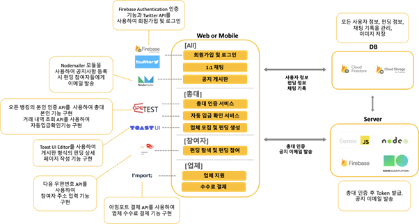
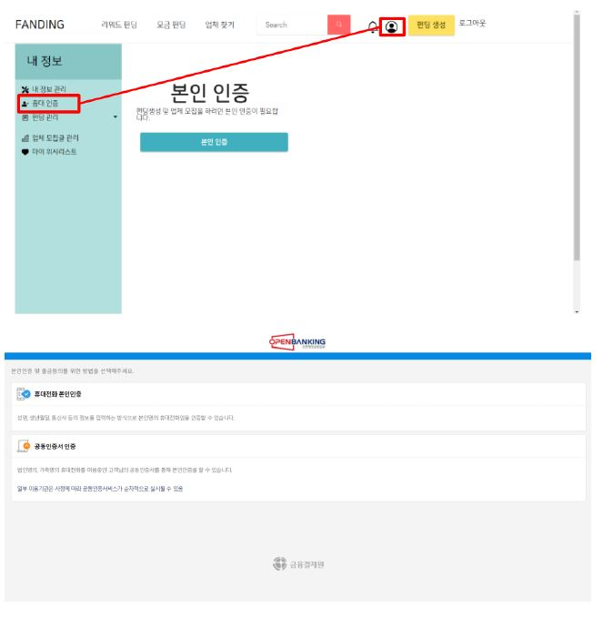
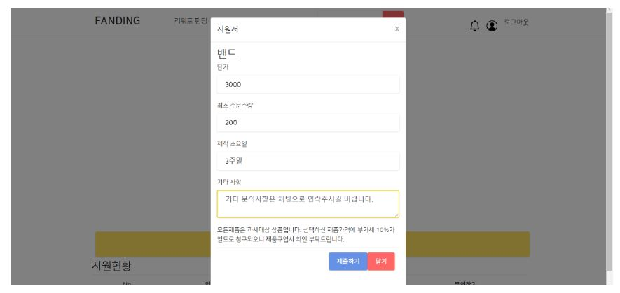
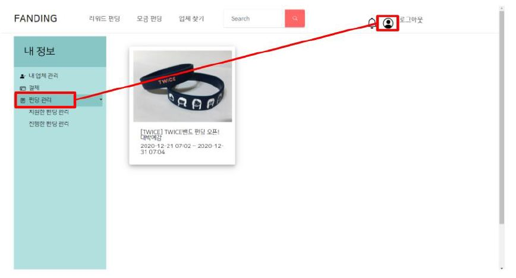

# FANDING 
---------------------------------------
## ■ About FANDING
- K-POP 팬을 위한 크라우드 펀딩 웹 애플리케이션 서비스
  (Crowdfunding service for fans who like K-pop)
  
  K-POP 시장이 성장하면서, K-POP 분야의 크라우드 펀딩이 SNS와 온라인 커뮤니티 중심으로 증가하고 있다. FANDING은 하나의 플랫폼 안에서 펀딩 기획부터 완료까지 한 번에 진행할 수 있는 서비스이다. 펀딩의 총책임자인 총대의 부담을 덜기 위해 업체를 모집하는 서비스와 자동 입금확인 서비스를 제공한다. 총대의 신뢰성을 보장하기 위해 본인인증을 도입하여 더욱 안전한 K-POP 크라우드 펀딩 생태계를 조성한다. SNS에 흩어진 정보를 하나로 모아줌으로써 참여자는 여러 펀딩을 비교해본 후 원하는 펀딩에 참여할 수 있다.
---------------------------------------
## ■ Authors & Role (가나다 순)
- 정재욱: Chatting, Payment
- 주재린: Open banking API, UI design, Notice
- 최진영: Full Stack, Funding, Server 
- 한지은: Application UI & Frontend
---------------------------------------
## ■ Main Target & Stakeholder
### Main Target
- **참여자** : 펀딩에 참여하는 사용자
- **총대** : 펀딩을 기획하고 주도적으로 진행하는 사람, 참여자들의 대표
- **업체** : 굿즈 제작 업체 및 서포트 업체(ex. 푸드 트럭)

#### [핵심시나리오 및 Stakeholder 관계도]

---------------------------------------
## ■ System Architecture
#### [전체 시스템 구조도]

#### [상세 시스템 구조]

---------------------------------------
## ■ Functions of FANDING
#### 1. 총대
- 로그인 및 회원가입 기능 (Twitter 로그인 포함)
- 펀딩 생성 기능
- 업체 모집 기능
- 펀딩 진행 기능
- 자동 입금 확인 기능 (오픈 뱅킹 API 이용) 
- 공지사항 작성 기능
- 1:1 채팅 기능

#### 2. 참여자
- 로그인 및 회원가입 기능 (Twitter 로그인 포함)
- 필터링 (최신순, 인기순)과 검색을 통한 펀딩 검색 기능 
- 펀딩 참여 기능
- 펀딩 진행 상황 및 공지사항 확인 기능
- 공지사항 업데이트 이메일 알림 기능 
- 1:1 채팅 기능

#### 3. 업체
- 로그인 및 회원가입 기능
- 필터링 (최신순, 인기순)과 검색을 통한 펀딩 검색 기능
- 업체 지원 기능
- 결제 기능
- 공지사항 작성 기능
- 1:1 채팅 기능
---------------------------------------
## ■ Framework & Language
- **Web**
  - Frontend: Reat, Reactstrap, BootStrap, Material-UI (HTML, CSS, javascript)
  - Backend: Node.js (Language: javacript)
  - DataBase: Firebase

- **사용하는 외부 API**
  - 오픈뱅킹 API
  - IamPort API
 
 #### [활용 기술 스택]
 
 
---------------------------------------
## ■ Result
### 1. 참여자 기능 화면
- [로그인 및 회원가입]

- [메인 페이지]

- [리워드 펀딩 목록]

- [펀딩 검색]

- [펀딩 상세 페이지]

- [펀딩 참여]

- [총대에게 문의(채팅)]

- [펀딩 찜하기]

- [펀딩 공유하기]

- [펀딩 공지사항]

- [공지사항 이메일 알람 확인]

- [내 정보 수정]

---------------------------------------------
### 2. 총대 화면
- [총대 본인 인증]

- [업체 모집 폼 생성]

- [업체 선정 & 업체 문의]

- [팬 인증하기]

- [펀딩 생성]

- [펀딩 관리]

- [펀딩 참여 현황]

- [참여자 문의사항 확인]

- [펀딩 마감]
  * 펀딩 마감 이전

   

  * 펀딩 마감 이후
  
   

- [펀딩 진행 상황 변경]

- [펀딩 공지사항 작성]

- [공지사항 작성 후]

---------------------------------------
### 3. 업체 기능 화면
- [업체 지원]

- [업체 지원서 작성]

- [업체 마이페이지 > 결제]

- [업체 결제 내역 리스트]

- [업체 결제 과정]

- [업체 마이페이지 > 펀딩 관리]

---------------------------------------
### 4. 팬딩관리자 기능 화면
- [관리자 ID 로그인 > 업체 결제 내역 관리]

---------------------------------------
## ■ Code
- public > index.html : SPA(Single Page Application), 화면이동에 필요한 html 코드
- src> components : 기능 구현을 위한 코드
- src > config : 구성을 위한 명세서 코드
- src > server : api를 Node.js로 처리하기 위한 proxy NodeJs server
- src > store : 상태 관리를 하는 장소 (redux)
- package.json : npm 패키지에 관한 정보와 의존중인 버전에 대한 관한 정보를 담은 코드
---------------------------------------
## ■ Reference
- reactstrap      <https://reactstrap.github.io/> 
- material-ui    <https://material-ui.com/>  
- material-icons <https://material-ui.com/components/material-icons/>
- react-icons <https://react-icons.github.io/react-icons/> 
- lifecycle of react <https://reactjs.org/docs/state-and-lifecycle.html/>

